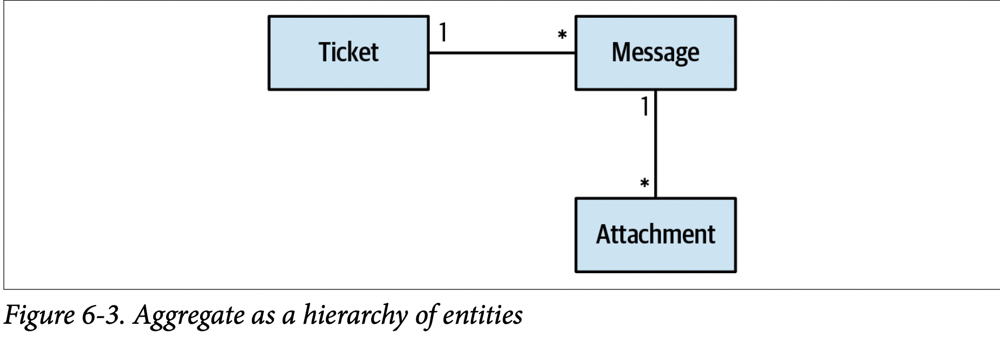
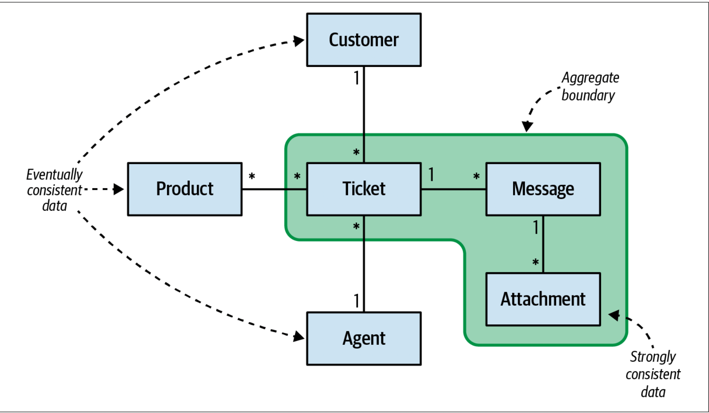
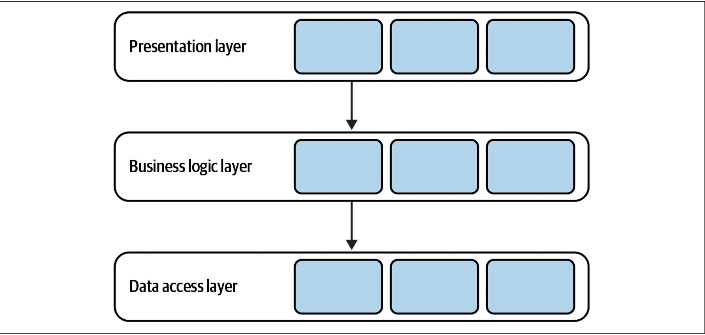
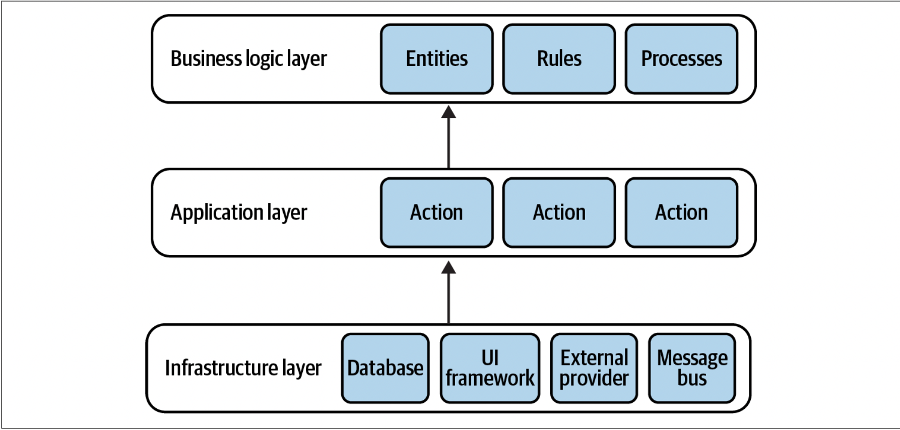
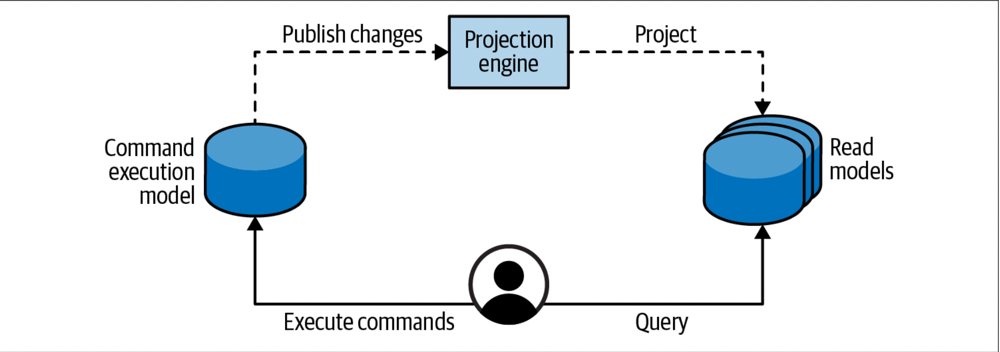
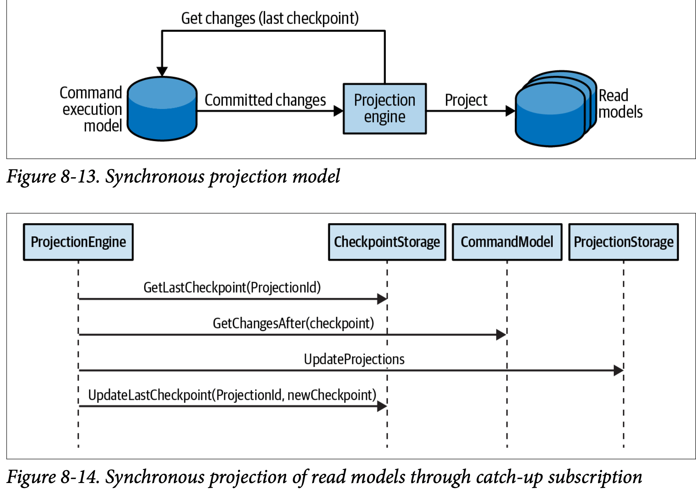
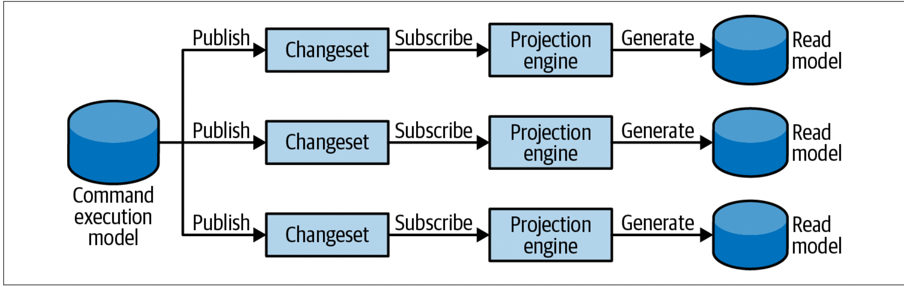

# Domain Driven Design 

To understand the problem, you have to understand the context within which it exists—the organization’s business strategy, and what value it seeks to gain by building the software.

**Subdomain Types**
- Core: A core subdomain is what a company does differently from its competitors. This may involve inventing new products or services or reducing costs by optimizing existing processes. The core subdomain is the heart of the business.
- Supporting: As the name suggests, supporting subdomains support the company’s business. However, contrary to core subdomains, supporting subdomains do not provide any competitive advantage.
- Generic: Generic subdomains are business activities that all companies are performing in the same way. _generic subdomains do not provide any competitive edge for the company_ 

## Business Domain
A business domain defines a company’s main area of activity. Generally speaking, it’s the service the company provides to its clients.
_A company can operate in multiple business domains._ 

## Subdomain
To achieve its business domain’s goals and targets, a company has to operate in multiple subdomains. A subdomain is a fine-grained area of business activity. _The subdomains have to interact with each other to achieve the company’s goals in its business domain._ 


Contrary to the core subdomains, supporting subdomains do not change often. 

All subdomains are required for the company to work in its business domain. The subdomains are like foundational building blocks: take one away and the whole structure may fall. Since core subdomains’ requirements are expected to change often and continuously, the solution must be maintainable and easy to evolve. Thus, core subdomains require the implementation of the most advanced engineering techniques


> It’s developers’ (mis)understanding, not domain experts’ knowledge, that gets released in production.

domain experts: it’s their job to specialize in and comprehend all the intricacies of the business domain. By no means should we, nor can we, become domain experts. That said, it’s crucial for us to understand domain experts and to use the same business terminology they use.

> As Alberto Brandolini1 says, software development is a learning process; working code is a side effect. A software project’s success depends on the effectiveness of knowledge sharing between domain experts and software engineers. We have to understand the problem in order to solve it

Research into why software projects fail has shown that effective communication is essential for knowledge sharing and project success


During the traditional software development lifecycle, the domain knowledge is “translated” into an engineer-friendly form known as an analysis model, which is a description of the system’s requirements rather than an understanding of the business domain behind it. While the intentions may be good, such mediation is hazardous to knowledge sharing. 

## Ubiquitous Language
Using a ubiquitous language is the cornerstone practice of domain-driven design. The idea is simple: if parties need to communicate efficiently, instead of relying on translations, they have to speak the same language.

- Domain knowledge into an analysis model
- Analysis model into requirements
- Requirements into system design
- System design into source code

The ubiquitous language must be precise and consistent. It should eliminate the need for assumptions and should make the business domain’s logic explicit.

- each term of the ubiquitous language should have one and only one meaning
- Two terms cannot be used interchangeably in a ubiquitous language.

## Model
A model is a simplified representation of a thing or phenomenon that intentionally emphasizes certain aspects while ignoring others. Abstraction with a specific use in mind. _A model is not a copy of the real world but a human construct that helps us make sense of real-world systems._ 

**All models have a purpose, and an effective model contains only the details needed to fulfill its purpose** In its essence, a model is an abstraction. The notion of abstraction allows us to handle complexity by omitting unnecessary details and leaving only what’s needed for solving the problem at hand.
> the purpose of abstracting is not to be vague but to create a new semantic level in which one can be absolutely precise.

Despite the obvious advantages of maintaining a glossary of project-related terminology, it has an inherent limitation. Glossaries work best for “nouns”: names of entities, processes, roles, and so on. Although nouns are important, capturing the behavior is crucial.

“jack of all trades, master of none.” Such models are supposed to be suitable for everything but eventually are effective for nothing.

## Bounded Context
The solution in domain-driven design is trivial: divide the ubiquitous language into multiple smaller languages, then assign each one to the explicit context in which it can be applied: its bounded context.


In a sense, terminology conflicts and implicit contexts are an inherent part of any decent-sized business. With the bounded context pattern, the contexts are modeled as an explicit and integral part of the business domain.

### Model Boundaries

A model cannot exist without a boundary; it will expand to become a copy of the real world.

Bounded contexts define the applicability of a ubiquitous language and of the model it represents. A language’s terminology, principles, and business rules are only consistent inside its bounded context. a ubiquitous language is ubiquitous only in the boundaries of its bounded context. 

A bounded context’s size, by itself, is not a deciding factor. Models shouldn’t necessarily be big or small. Models need to be useful. The wider the boundary of the ubiquitous language is, the harder it is to keep it consistent. The smaller they are, the more integration overhead the design induces.

Therefore, keep your models useful and align the bounded contexts’ sizes with your business needs and organizational constraints.

Having a one-to-one relationship between bounded contexts and subdomains can be perfectly reasonable in some scenarios. In others, however, different decomposition strategies can be more suitable.

As we discussed earlier, a bounded context can contain multiple subdomains. In such a case, the bounded context is a physical boundary, while each of its subdomains is a logical boundary. Logical boundaries bear different names in different programming languages: namespaces, modules, or packages.

It can be said that domain-driven design’s bounded contexts are based on the lexicographical notion of semantic domains. A semantic domain is defined as an area of meaning and the words used to talk about it. For example, the words monitor, port, and processor have different meanings in the software and hardware engineering semantic domains.


## Integrating Bounded Contexts
Moreover, models in different bounded contexts can be evolved and implemented independently. That said, bounded contexts themselves are not independent. Just as a system cannot be built out of independent components—the components have to interact with one another to achieve the system’s overarching goals—so, too, do the implementations in bounded contexts. Although they can evolve independently, they have to integrate. As a result, there will always be touchdowns between bounded contexts. These are called contracts.


- **Partnership**

Bounded contexts are integrated in an ad hoc manner.

- **Shared kernel**

Two or more bounded contexts are integrated by sharing a limited overlapping model that belongs to all participating bounded contexts.

It’s crucial to stress that the shared model is designed according to the needs of all of the bounded contexts.


The overarching applicability criterion for the shared kernel pattern is the cost of duplication versus the cost of coordination 

the shared kernel will naturally be applied to the subdomains that change the most: the core subdomains.


- **Conformist**


The consumer conforms to the service provider’s model.


- **Anticorruption layer**

The consumer translates the service provider’s model into a model that fits the consumer’s needs.


- **Open-host service**

The service provider implements a published language—a model optimized for its consumers’ needs.


- **Separate ways**
It’s less expensive to duplicate particular functionality than to collaborate and integrate it.

# Context Map

After analyzing the integration patterns between a system’s bounded contexts, we can plot them on a context map. The context map is a visual representation of the system’s bounded contexts and the integrations between them. 


# Implementation 

Business logic is the most important part of the software. It’s the reason the software is being implemented in the first place. A system’s user interface can be sexy and its database can be blazing fast and scalable. But if the software is not useful for the business, it’s nothing but an expensive technology demo.

## Transaction Script
> Organizes business logic by procedures where each procedure handles a single request from the presentation. "Martin Fowler"

The only requirement procedures have to fulfill is transactional behavior. Each operation should either succeed or fail but can never result in an invalid state. 

The thing is, the transaction script pattern is a foundation for the more advanced business logic implementation patterns

data corruption problem can lead to: 
- Lack of transactional behavior
- Distributed transactions
- Implicit distributed transactions

## Active Record
> An object that wraps a row in a database table or view, encapsulates the database access, and adds domain logic on that data

Consequently, this pattern uses dedicated objects, known as active records, to represent complicated data structures.

## Be Pragmatic
Although business data is important and the code we design and build should protect its integrity, there are cases in which a pragmatic approach is more desirable.
Especially at high levels of scale, there are cases when data consistency guarantees can be relaxed. Check whether corrupting the state of one record out of 1 million is really a showstopper for the business and whether it can negatively affect the performance and profitability of the business. For example, let’s assume you are building a system that ingests billions of events per day from IoT devices. Is it a big deal if 0.001% of the events will be duplicated or lost?
As always, there are no universal laws. It all depends on the business domain you are working in. It’s OK to “cut corners” where possible; just make sure you evaluate the risks and business implications.

# Domain Model

The domain model pattern is intended to cope with cases of complex business logic. Here, instead of CRUD interfaces, we deal with complicated state transitions, business rules, and invariants: rules that have to be protected at all times.

A domain model is an object model of the domain that incorporates both behavior and data. DDD’s tactical patterns—aggregates, value objects, domain events, and domain services—are the building blocks of such an object mode

The domain’s business logic is already inherently complex, so the objects used for modeling it should not introduce any additional accidental complexities. The model should be devoid of any infrastructural or technological concerns, such as implementing calls to databases or other external components of the system. This restriction requires the model’s objects to be plain old objects, objects implementing business logic without relying on or directly incorporating any infrastructural components or frameworks

## Building Blocks

### Value object
A value object is an object that can be identified by the composition of its values.

When to use value objects. The simple answer is, whenever you can.

example: 
```java
class Person {
    private PersonId _id; 
    private Name _name; 
    private PhoneNumber _landline; 
    private PhoneNumber _mobile; 
    private EmailAddress _email; 
    private Height _height; 
    private CountryCode _country;
    
    public Person(...) { ... } 
}

static void Main(string[] args) {
    var dave = new Person(
        id: new PersonId(30217),
        name: new Name("Dave", "Ancelovici"), 
        landline: PhoneNumber.Parse("023745001"), 
        mobile: PhoneNumber.Parse("0873712503"), 
        email: Email.Parse("dave@learning-ddd.com"), height: Height.FromMetric(180),
        country:  CountryCode.Parse("BG"));
    )
    // ...
}
```

## Aggregates

A hierarchy of entities sharing a transactional boundary. All of the data included in an aggregate’s boundary has to be strongly consistent to implement its business logic.

An aggregate is an entity: it requires an explicit identification field and its state is expected to change during an instance’s lifecycle. However, it is much more than just an entity. The goal of the pattern is to protect the consistency of its data. Since an aggregate’s data is mutable, there are implications and challenges that the pattern has to address to keep its state consistent at all times.

**aggregate’s state can only be modified by its own business logic, Furthermore, no system operation can assume a multi-aggregate transaction. A change to an aggregate’s state can only be committed individually, one aggregate per database transaction.**

DDD prescribes that a system’s design should be driven by its business domain. Aggregates are no exception. To support changes to multiple objects that have to be applied in one atomic transaction, the aggregate pattern resembles a hierarchy of entities, all sharing transactional consistency



The hierarchy contains both entities and value objects, and all of them belong to the same aggregate if they are bound by the domain’s business logic.
That’s why the pattern is named “aggregate”: it aggregates business entities and value objects that belong to the same transaction boundary.

Since all objects contained by an aggregate share the same transactional boundary, performance and scalability issues may arise if an aggregate grows too large.



## Domain services

A domain service is a stateless object that implements business logic. In the vast majority of cases, such logic orchestrates calls to various components of the system to perform some calculation or analysis.

# Architectural Patterns

The variety of concerns that a codebase has to take care of makes it easy for its business logic to become diffused among the different components: that is, for some of the logic to be implemented in the user interface or database, or be duplicated in different components.

Lacking strict organization in implementation concerns makes the codebase hard to change. When the business logic has to change, it may not be evident what parts of the codebase have to be affected by the change. The change may have unexpected effects on seemingly unrelated parts of the system. Conversely, it may be easy to miss code that has to be modified. All of these issues dramatically increase the cost of maintaining the codebase.

## Layered Architecture



In its classic form, the layered architecture consists of three layers: the presentation layer (PL), the business logic layer (BLL), and the data access layer (DAL).

- Presentation layer = user interface layer
- Service layer = application layer
- Business logic layer = domain layer = model layer
- Data access layer = infrastructure layer

## Ports & Adapters

The ports & adapters architecture addresses the shortcomings of the layered architecture and is a better fit for the implementation of more complex business logic. Interestingly, both patterns are quite similar.

The dependency inversion principle (DIP) states that high-level modules, which implement the business logic, should not depend on low-level modules. However, that’s precisely what happens in the traditional layered architecture. The business logic layer depends on the infrastructure layer. 



The core goal of the ports & adapters architecture is to decouple the system’s business logic from its infrastructural components.

## Command-Query Responsibility Segregation

The command-query responsibility segregation (CQRS) pattern is based on the same organizational principles for business logic and infrastructural concerns as ports & adapters. It differs, however, in the way the system’s data is managed. This pattern enables representation of the system’s data in multiple persistent models

Another reason for working with multiple models may have to do with the notion of polyglot persistence. There is no perfect database. Or, as Greg Young6 says, all databases are flawed, each in its own way: we often have to balance the needs for scale, consistency, or supported querying models.

Originally, CQRS was defined to address the limited querying possibilities of an event-sourced model: it is only possible to query events of one aggregate instance at a time

As the name suggests, the pattern segregates the responsibilities of the system’s models. There are two types of models: the command execution model and the read models.

CQRS devotes a single model to executing operations that modify the system’s state (system commands). This model is used to implement the business logic, validate rules, and enforce invariants.



### Projecting Read Models

1. Synchronous

For the catch-up subscription to work, the command execution model has to checkpoint all the appended or updated database records. The storage mechanism should also support the querying of records based on the checkpoint.



2. Asynchronous projections

In the asynchronous projection scenario, the command execution model publishes all committed changes to a message bus. The system’s projection engines can subscribe to the published messages and use them to update the read models



# EventStorming

EventStorming is a low-tech activity for a group of people to brainstorm and rapidly model a business process. In a sense, EventStorming is a tactical tool for sharing business domain knowledge.

An EventStorming session has a scope: the business process that the group is interested in exploring.


