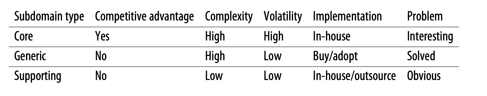

# Domain Driven Design 

To understand the problem, you have to understand the context within which it exists—the organization’s business strategy, and what value it seeks to gain by building the software.

**Subdomain Types**
- Core: A core subdomain is what a company does differently from its competitors. This may involve inventing new products or services or reducing costs by optimizing existing processes. The core subdomain is the heart of the business.
- Supporting: As the name suggests, supporting subdomains support the company’s business. However, contrary to core subdomains, supporting subdomains do not provide any competitive advantage.
- Generic: Generic subdomains are business activities that all companies are performing in the same way. _generic subdomains do not provide any competitive edge for the company_ 

## Business Domain
A business domain defines a company’s main area of activity. Generally speaking, it’s the service the company provides to its clients.
_A company can operate in multiple business domains._ 

## Subdomain
To achieve its business domain’s goals and targets, a company has to operate in multiple subdomains. A subdomain is a fine-grained area of business activity. _The subdomains have to interact with each other to achieve the company’s goals in its business domain._ 

Contrary to the core subdomains, supporting subdomains do not change often. 

All subdomains are required for the company to work in its business domain. The subdomains are like foundational building blocks: take one away and the whole structure may fall. Since core subdomains’ requirements are expected to change often and continuously, the solution must be maintainable and easy to evolve. Thus, core subdomains require the implementation of the most advanced engineering techniques

> It’s developers’ (mis)understanding, not domain experts’ knowledge, that gets released in production.